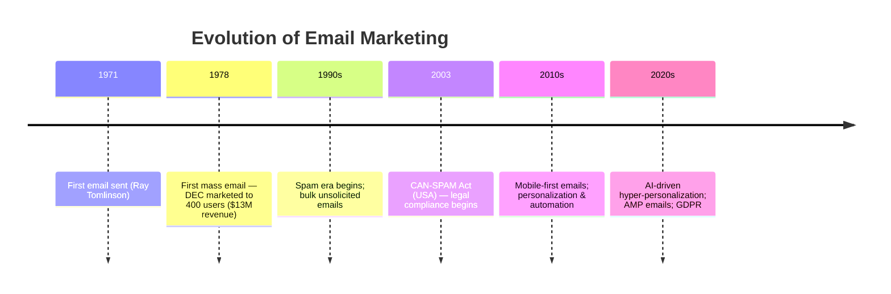
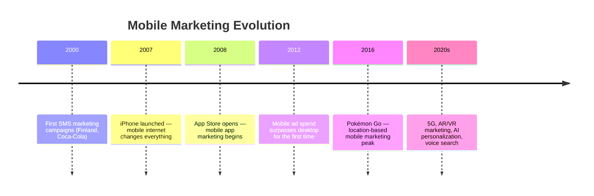

# 📘 Digital Marketing — UNIT III
### Last-Minute Revision Notes | SEM · Email Marketing · Mobile Marketing

---

> **How to use this doc:** Skim headings → read bullets → check tables → test yourself on Quick Revision Boxes → final glance at Ultra-Quick Table.

---

# 1. Search Engine Marketing (SEM)

## 1.1 What is SEM?

> **Definition:** SEM is paid advertising on search engines to gain visibility in Search Engine Results Pages (SERPs). You *pay* to appear — unlike SEO which is *earned*.

**Example:** You Google "buy running shoes" → first 2–3 results marked "Sponsored" = SEM. Nike/Adidas paid Google to be there.

### SEM vs SEO — Quick Comparison

| Feature | SEM (Paid) | SEO (Organic) |
|---|---|---|
| Speed | Instant visibility | Takes months |
| Cost | Pay per click | Time investment |
| Position control | Yes (bid-based) | No guarantee |
| Sustainability | Stops when budget ends | Long-lasting |
| Trust | Slightly lower (ads) | Higher |
| Best for | Product launches, offers | Long-term brand building |

---

## 1.2 SEM Objectives

- **Drive traffic** — bring qualified visitors to website
- **Generate leads** — capture contact info via landing pages
- **Boost sales/conversions** — e-commerce direct purchases
- **Build brand awareness** — even if no click happens (impressions matter)
- **Compete for keywords** — counter competitor ads

**Exam Tip ⚠️:** Objectives align with the *funnel stage* — Awareness (impressions) → Consideration (clicks) → Conversion (purchases).

---

## 1.3 SEM Considerations

Before running campaigns, evaluate:

- **Budget** — CPC (Cost Per Click) varies by keyword competitiveness
- **Target Audience** — demographics, intent, geography
- **Keyword Relevance** — match user intent accurately
- **Landing Page Quality** — poor landing page = wasted ad spend
- **Quality Score** — Google's rating of your ad relevance (1–10); higher = lower CPC
- **Competition** — branded keywords are expensive; long-tail is cheaper

**Example:** "shoes" is expensive (high competition). "red Nike running shoes size 10" is cheaper and converts better → **long-tail keyword strategy**.

---

## 1.4 SEM Strategies and Tactics

### Core Strategies

```
Search Intent → Keyword Match → Ad Copy → Landing Page → Conversion
```

| Strategy | Description | Example |
|---|---|---|
| **Branded keywords** | Bid on your own brand name | "Flipkart sale" |
| **Competitor keywords** | Bid on rival's brand | Meesho bidding on "Amazon deals" |
| **Long-tail keywords** | Specific low-competition phrases | "best wireless earbuds under 2000" |
| **Remarketing** | Re-target users who visited before | Amazon showing you the cart you abandoned |
| **Geo-targeting** | Ads shown in specific locations | "Pizza delivery Mumbai" |
| **Ad scheduling** | Show ads only during peak hours | Restaurant ads at 11am–1pm |

### Keyword Match Types

| Type | Syntax | Meaning | Example |
|---|---|---|---|
| Broad Match | `shoes` | Any related query | "footwear", "sneakers" |
| Phrase Match | `"running shoes"` | Exact phrase in query | "buy running shoes online" |
| Exact Match | `[running shoes]` | Only exact phrase | "running shoes" only |
| Negative Match | `-cheap` | Exclude these terms | Won't show for "cheap shoes" |

**Exam Trap ⚠️:** Broad match gets max reach but low precision. Exact match = high precision, low reach. Use a mix!

---

## 1.5 SEM Content Strategies and Tactics

### Ad Copy Best Practices

- **Headline** (30 chars) — use keyword in H1
- **Description** (90 chars) — highlight USP + CTA
- **Display URL** — keyword-rich URL path
- **Ad Extensions** — sitelinks, call, location, price, reviews

### Content Tactics

| Tactic | What it does |
|---|---|
| **Dynamic Keyword Insertion (DKI)** | Auto-inserts search term into ad headline |
| **Responsive Search Ads (RSA)** | Google tests multiple headline/desc combos |
| **Ad Extensions** | Add phone, links, ratings to expand ad real estate |
| **A/B Testing** | Compare 2 ad versions; keep the winner |

**Example:** DKI — if user searches "leather wallet", ad headline auto-reads "Buy Leather Wallet Now" — more relevant = higher CTR.

---

## 1.6 SEM Key Metrics & Formulas

| Metric | Formula | What it tells you |
|---|---|---|
| **CTR** | Clicks ÷ Impressions × 100 | % who clicked the ad |
| **CPC** | Total Cost ÷ Total Clicks | Cost per visitor |
| **CPA** | Total Cost ÷ Conversions | Cost per acquisition |
| **ROAS** | Revenue ÷ Ad Spend | Return on ad investment |
| **Quality Score** | Relevance of keyword + ad + landing page (1–10) | Affects rank & CPC |
| **Ad Rank** | Quality Score × Max CPC Bid | Determines ad position |

**Key Formula:**
```
Ad Rank = Max CPC Bid × Quality Score
Higher Quality Score = Lower cost + Better position 🎯
```

---

> ### 🔁 Quick Revision Box — SEM
> - SEM = **paid search ads**; SEO = **earned rankings**
> - **Quality Score** (1–10) determines ad rank & CPC — improve with relevance
> - **Long-tail keywords** = cheaper, higher intent, better conversion
> - **Ad Rank = Bid × Quality Score** — better content wins over higher bids
> - Key metrics: **CTR, CPC, CPA, ROAS**

---

# 2. Email Marketing Strategy

## 2.1 Evolution and Value of Email Marketing

### Evolution Timeline



### Why Email Marketing Matters

| Value Metric | Stat / Insight |
|---|---|
| **ROI** | ~$36–42 return per $1 spent (highest of all channels) |
| **Ownership** | You own your list — no algorithm dependency |
| **Personalization** | Can segment by behavior, demographics, purchase history |
| **Automation** | Works 24/7 (drip campaigns, triggers) |
| **Reach** | 4+ billion email users globally |

**Example:** Zomato's witty emails ("Your order was delivered faster than you can say 'I'm hungry'") = high open rates through personalization + tone.

---

## 2.2 Email Marketing Considerations

### Key Decisions Before Sending

- **Permission-based list** — opt-in only (GDPR/CAN-SPAM compliance)
- **Segmentation** — don't blast one email to all subscribers
- **Frequency** — too many = unsubscribes; too few = low engagement
- **Timing** — Tues–Thurs 10am–2pm tends to perform well
- **Mobile optimization** — 60%+ emails opened on mobile
- **Deliverability** — avoid spam triggers (ALL CAPS, excessive exclamation marks!!!)

**Exam Trap ⚠️:** Permission vs. Double Opt-in:
- **Single opt-in** = one click to subscribe (faster, less verified)
- **Double opt-in** = confirm via email link (cleaner list, higher quality)

---

## 2.3 Email Marketing Strategies and Tactics

### Email Types

| Type | Purpose | Example |
|---|---|---|
| **Welcome Email** | Onboard new subscriber | "Welcome to Swiggy! Here's 20% off" |
| **Newsletter** | Regular updates/content | Weekly blog digest |
| **Promotional** | Drive sales / offers | "Flash Sale — 50% off ends tonight!" |
| **Transactional** | Order/account updates | Shipping confirmation, OTP |
| **Drip Campaign** | Automated sequence over time | 7-day onboarding series |
| **Re-engagement** | Win back inactive users | "We miss you! Here's a coupon" |
| **Cart Abandonment** | Recover lost sales | "You left something behind…" |

### Key Strategies

```
Segment → Personalize → Automate → Analyze → Optimize (Loop)
```

- **Segmentation:** By location, behavior, purchase history, age
- **Personalization:** Use first name, product recommendations, birthday emails
- **Automation:** Trigger-based emails (sign-up → welcome sequence)
- **List hygiene:** Remove bounced/inactive emails regularly
- **A/B Testing:** Test subject lines, CTAs, layouts

---

## 2.4 Email Content and Design Strategies

### Anatomy of a High-Converting Email

```
[SENDER NAME] — builds trust
[SUBJECT LINE] — determines open rate (50 chars max)
[PREHEADER TEXT] — preview text below subject (40–100 chars)
[HEADER / LOGO]
[HERO IMAGE or TEXT]
[BODY COPY] — short, scannable, benefit-focused
[CTA BUTTON] — single, prominent, action-oriented
[FOOTER] — unsubscribe link (legally required!)
```

### Design Best Practices

| Element | Best Practice |
|---|---|
| Subject Line | 6–10 words; create urgency/curiosity; use emoji sparingly 🎯 |
| CTA | Single CTA; contrasting color; verb-first ("Shop Now") |
| Images | Compressed; always add alt text (images may not load) |
| Mobile | Single-column layout; 14–16px font; large tap targets |
| Personalization | `Hi [First Name]` in subject → +26% open rate |
| Preheader | Complement subject line, not repeat it |

**Example:**
- Subject: "🔥 Your cart is about to expire, Riya"
- Preheader: "3 items left in stock — grab them before they're gone"

---

## 2.5 Email Marketing Analytics

### Core Metrics

| Metric | Formula | Benchmark |
|---|---|---|
| **Open Rate** | Opens ÷ Delivered × 100 | 20–25% |
| **CTR (Click-Through Rate)** | Clicks ÷ Delivered × 100 | 2–5% |
| **CTOR (Click-to-Open Rate)** | Clicks ÷ Opens × 100 | 10–20% |
| **Conversion Rate** | Conversions ÷ Clicks × 100 | Varies by goal |
| **Bounce Rate** | Bounced ÷ Sent × 100 | <2% ideal |
| **Unsubscribe Rate** | Unsubs ÷ Delivered × 100 | <0.5% ideal |
| **Spam Complaint Rate** | Complaints ÷ Sent × 100 | <0.1% |
| **List Growth Rate** | (New - Unsubs) ÷ Total × 100 | Track monthly |

### Hard Bounce vs Soft Bounce

| Type | Meaning | Action |
|---|---|---|
| **Hard Bounce** | Permanent delivery failure (invalid email) | Remove from list immediately |
| **Soft Bounce** | Temporary issue (full inbox, server down) | Retry a few times, then remove |

**Exam Trap ⚠️:** CTOR is a better content engagement metric than CTR alone. CTR is affected by deliverability; CTOR isolates content quality.

---

> ### 🔁 Quick Revision Box — Email Marketing
> - Highest ROI of all digital channels (~$36 per $1 spent)
> - **Permission-based + segmented + personalized** = best results
> - **Subject line** determines open rate — test multiple variations
> - Key metrics: **Open Rate, CTR, CTOR, Bounce Rate, Unsubscribe Rate**
> - **Hard bounce** = permanent fail → delete; **Soft bounce** = temporary → retry

---

# 3. Mobile Marketing Strategy

## 3.1 Evolution and Value of Mobile Marketing

### Evolution Timeline



### Why Mobile Marketing is Critical

| Factor | Impact |
|---|---|
| **Penetration** | 5+ billion mobile users globally |
| **Screen time** | Avg. 4–5 hrs/day on mobile |
| **Always-on** | Device is always nearby; instant reach |
| **Location data** | Geo-targeting based on real-time location |
| **Multi-channel** | SMS, app, web, social, voice — all mobile |

**Example:** Starbucks' loyalty app uses mobile ordering, push notifications, and location-based offers — all in one mobile experience.

---

## 3.2 Mobile Marketing Considerations

### Key Factors Before Planning

- **Device fragmentation** — Android vs iOS; different screen sizes
- **Data/bandwidth** — heavy assets (video) may not load on slow networks
- **Context** — users are on-the-go; need fast, frictionless experience
- **Privacy** — App tracking transparency (Apple ATT), GDPR
- **User intent** — mobile = micro-moments (I-want-to-know, -go, -do, -buy)
- **Consent** — push notification opt-in required; SMS needs explicit opt-in

### Google's 4 Micro-Moments

| Moment | Intent | Example |
|---|---|---|
| **I-want-to-know** | Research | "best DSLR camera" |
| **I-want-to-go** | Local | "coffee shop near me" |
| **I-want-to-do** | How-to | "how to tie a tie" |
| **I-want-to-buy** | Purchase | "buy iPhone 15 online" |

---

## 3.3 Mobile Marketing Strategies and Tactics

### Channels & Tactics

| Channel | Tactic | Example |
|---|---|---|
| **SMS Marketing** | Bulk texts, OTPs, offers | Domino's "20% off today only. Reply STOP to opt out" |
| **Push Notifications** | App-triggered alerts | Swiggy: "Your order is 5 mins away 🚴" |
| **In-App Advertising** | Banner, interstitial, rewarded | Google AdMob in free apps |
| **Mobile Email** | Responsive design for small screens | Gmail mobile |
| **QR Codes** | Bridge offline to online | Scan menu at restaurant |
| **Location-Based (LBS)** | Geofencing, beacon marketing | Near McDonald's → get discount notification |
| **Mobile Search Ads** | Google ads optimized for mobile | "Call" button instead of URL |
| **Social Mobile Ads** | Instagram/Snapchat Stories ads | Full-screen vertical video |
| **Mobile Wallets** | Apple Pay, Google Pay offers | Coupons via Paytm wallet |

### Key Strategic Frameworks

**SMS vs Push Notification**

| Feature | SMS | Push Notification |
|---|---|---|
| Requires app | No | Yes |
| Open rate | ~98% | ~20–40% |
| Cost | Per message | Free |
| Reach | All phones | Only app users |
| Personalization | Limited | High |

---

## 3.4 Mobile Marketing Content Strategies and Tactics

### Mobile-First Content Principles

- **Vertical video** — Instagram Reels, TikTok, YouTube Shorts (9:16 ratio)
- **Short-form** — attention span is ~8 seconds; get to the point
- **Voice search optimization** — conversational, question-based keywords
- **AMP (Accelerated Mobile Pages)** — Google's fast-loading mobile pages
- **Thumb zone design** — key buttons within thumb reach on screen

### App Store Optimization (ASO) — Mobile's version of SEO

| ASO Element | Best Practice |
|---|---|
| App Title | Include primary keyword |
| Description | First 3 lines = most read; include keywords |
| Screenshots | Show real UI value; first screenshot is critical |
| Ratings & Reviews | Prompt happy users to rate |
| Icon | Distinctive, brand-consistent |

**Example:** Duolingo's app icon (the green owl) is immediately recognizable → strong brand recall in app store.

---

## 3.5 Mobile Marketing Analytics

### Key Mobile Metrics

| Metric | Formula/Definition | Significance |
|---|---|---|
| **DAU/MAU** | Daily/Monthly Active Users | Engagement quality |
| **App Downloads** | Total installs | Reach |
| **Retention Rate** | Users returning after Day 1/7/30 | Stickiness |
| **Churn Rate** | % users who stop using app | Opposite of retention |
| **Session Length** | Avg time per app session | Engagement depth |
| **Push Opt-in Rate** | Users who allow notifications ÷ Total | Notification reach |
| **CTR (mobile ads)** | Clicks ÷ Impressions | Ad performance |
| **CPI (Cost Per Install)** | Ad Spend ÷ App Installs | Campaign efficiency |
| **LTV (Lifetime Value)** | Revenue from user over their lifetime | Long-term value |
| **ARPU** | Revenue ÷ Active Users | Monetization efficiency |

### Mobile Funnel Metrics

```
Impression → Click → Install → Register → Active User → Paying User
    ↓            ↓        ↓          ↓            ↓             ↓
 (CTR)        (CPI)   (CR%)    (Activation)  (DAU)         (LTV)
```

**Key Formula:**
```
Retention Rate (Day N) = Users active on Day N ÷ Users who installed × 100

Day 1 benchmark: ~25–30%
Day 7 benchmark: ~10–15%
Day 30 benchmark: ~5–7%
```

**Exam Trap ⚠️:** Don't confuse **CPI (Cost Per Install)** with **CPC (Cost Per Click)**. CPI is app-specific.

---

> ### 🔁 Quick Revision Box — Mobile Marketing
> - Mobile = micro-moments: I-want-to-know/go/do/buy
> - **SMS open rate ~98%** — highest of any channel (but needs opt-in)
> - **ASO = App Store Optimization** (SEO for apps)
> - Key metrics: **DAU, Retention Rate, CPI, LTV, ARPU**
> - Mobile-first content: **vertical video, short-form, voice-optimized**

---

---

# 🗂️ Ultra-Quick Revision Table — UNIT III

| Topic | Core Concept | Key Strategy | Key Metric | Remember This |
|---|---|---|---|---|
| **SEM** | Paid search ads on Google/Bing | Keyword match types + Quality Score | CTR, CPC, ROAS, Ad Rank | Ad Rank = Bid × Quality Score |
| **SEM Content** | Ad copy + landing page alignment | Dynamic keyword insertion, RSA, A/B test | Quality Score, Conversion Rate | Better relevance = lower cost |
| **Email Marketing** | Permission-based direct communication | Segment → Personalize → Automate | Open Rate, CTR, CTOR, Bounce Rate | CTOR measures content quality |
| **Email Design** | Mobile-first, single CTA, strong subject | A/B test subject lines, preheader | Open Rate, Unsubscribe Rate | Subject line = 50 chars max |
| **Mobile Marketing** | Always-on, location-aware channel | Micro-moments, geofencing, push/SMS | DAU, Retention, CPI, LTV | SMS open rate = 98% |
| **Mobile Content** | Short-form, vertical, voice-ready | ASO, AMP pages, thumb zone UX | Session length, App downloads | ASO = SEO for App Stores |
| **SEM vs SEO** | Paid vs Organic | Immediate vs Long-term | CPC vs Organic rank | SEM stops when budget stops |
| **SMS vs Push** | All phones vs App users | Both need explicit opt-in | Open rate: SMS 98%, Push 20–40% | Push is free; SMS costs per msg |
| **Hard vs Soft Bounce** | Email delivery failure | Remove hard; retry soft | Bounce Rate <2% | Hard = delete immediately |
| **Long-tail Keywords** | Specific, low competition | Higher intent = higher CVR | Lower CPC, Higher ROI | "running shoes" vs "best cheap red running shoes" |

---

> 💡 **Final Exam Tips:**
> - SEM questions often test **Ad Rank formula** and **keyword match types**
> - Email questions love **CTOR vs CTR** distinction and **hard vs soft bounce**
> - Mobile questions focus on **micro-moments**, **ASO**, and **CPI vs CPC**
> - Always connect strategy to the **marketing funnel stage** (Awareness → Conversion)