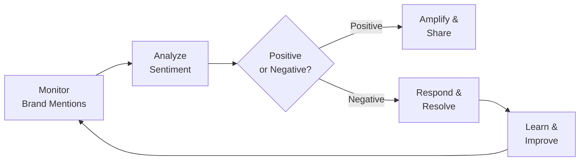
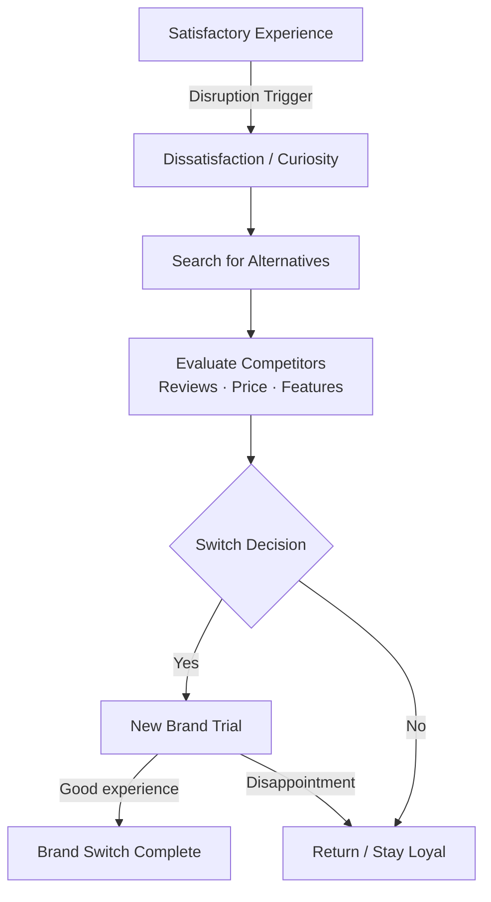
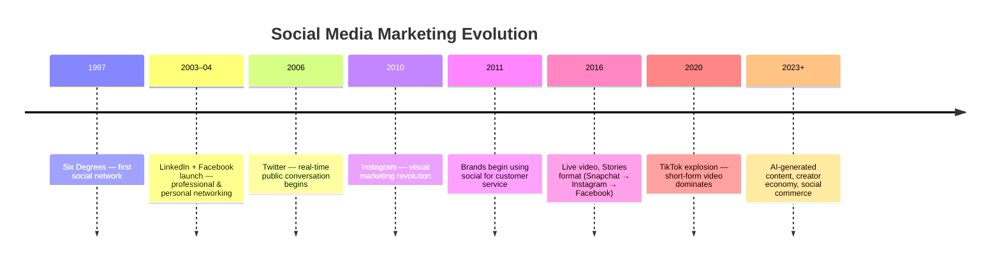

# 📘 Digital Marketing — UNIT IV
### Last-Minute Revision Notes | Digital Brand & Reputation · Social Media & Community Marketing

---

> **How to use this doc:** Skim headings → read bullets → check tables → test yourself on Quick Revision Boxes → final glance at Ultra-Quick Table.

---

# 1. Digital Brand, Trust, and Reputation Management Strategy

## 1.1 What is Digital Brand Management?

> **Definition:** The process of building, maintaining, and protecting a brand's identity, perception, and credibility across all digital touchpoints.

> **Trust:** The consumer's confidence that a brand will deliver on its promises consistently.

> **Reputation:** The collective perception of a brand formed by all stakeholders — customers, media, competitors, public.

**Example:** Zomato's witty Twitter presence builds a *fun, relatable* brand. One viral tweet gone wrong can damage that in minutes — reputation is fragile online.

---

## 1.2 The Brand Trust Pyramid

```
         🏆 ADVOCACY
        (Loyal promoters)
       ──────────────────
      💛 COMMITMENT
     (Repeat purchases)
    ────────────────────
   ✅ SATISFACTION
  (Positive experience)
 ──────────────────────
🔍 FAMILIARITY
(Awareness + recognition)
```

Each level must be earned before moving to the next. **Trust is the bridge between satisfaction and commitment.**

---

## 1.3 Key Pillars of Online Brand Trust

| Pillar | What it means | How to build it |
|---|---|---|
| **Consistency** | Same voice, look, message across channels | Brand guidelines, tone of voice docs |
| **Transparency** | Honest communication, no hidden agendas | Public pricing, open policies |
| **Authenticity** | Genuine brand personality | Real stories, behind-the-scenes content |
| **Social Proof** | Others validate your brand | Reviews, ratings, UGC, testimonials |
| **Responsiveness** | Quick replies to queries/complaints | <24hr response time on DMs, comments |
| **Security** | Safe transactions, data privacy | SSL certificates, GDPR compliance |

**Example:** Amazon's 1-click purchase trust = result of years of consistent delivery + hassle-free returns + secure payments.

---

## 1.4 Online Reputation Management (ORM)

> **Definition:** The practice of monitoring, influencing, and managing what appears online when someone searches for your brand.

### ORM Workflow



### ORM Strategies

| Strategy | Action | Tool/Example |
|---|---|---|
| **Search Listening** | Track brand mentions online | Google Alerts, Mention.com |
| **Review Management** | Respond to all reviews (positive + negative) | Google Business, Trustpilot |
| **SEO for Reputation** | Push positive content to rank above negative | Publish blogs, press releases |
| **Crisis Management** | Rapid, empathetic response to PR crises | Designated crisis communication team |
| **Influencer Advocacy** | Use influencers to build positive brand narrative | Collaborate with micro-influencers |
| **Content Marketing** | Create valuable owned content | Thought leadership articles, case studies |

### Responding to Negative Reviews — The Formula

```
Acknowledge → Apologize → Act → Follow Up
```

**Example:**
- ❌ Bad: "We're sorry you feel that way."
- ✅ Good: "Hi Priya, we're sorry your order was delayed. We've issued a full refund and a 20% voucher. DM us if you need anything else!"

---

## 1.5 Brand Switching Online

> **Definition:** Brand switching is when a consumer stops purchasing from one brand and moves to a competitor — often triggered by a negative experience, better offer, or peer influence.

### Why Customers Switch Brands Online

| Trigger | Description | Example |
|---|---|---|
| **Price/Value** | Competitor offers better deal | Amazon vs Flipkart price war |
| **Bad Experience** | Poor service, delayed delivery | One bad Swiggy delivery → switch to Zomato |
| **Peer Influence** | Friends/social media recommend rival | "Everyone's using Notion now" |
| **Better Features** | Competitor launches superior product | WhatsApp users switching to Telegram for privacy |
| **Loss of Trust** | Data breach, controversy, fake reviews | #DeleteUber movement (2017) |
| **Convenience** | Easier UX on competitor platform | Paytm vs PhonePe — cleaner UI wins |
| **FOMO / Trends** | New brand goes viral | Blinkit vs Zepto — speed wars |

### Brand Switching Model (Online Context)



### How to Prevent Brand Switching

- **Loyalty programs** — reward repeat customers (Starbucks Rewards, Nykaa Loyalty Points)
- **Personalization** — make customers feel known (Netflix recommendations)
- **Proactive outreach** — reach out before they complain
- **Switching barriers** — data lock-in, contracts, ecosystem stickiness (Apple ecosystem)
- **Community building** — emotionally attached customers don't switch easily
- **Rapid complaint resolution** — resolve within first contact

### How to Attract Brand Switchers FROM competitors

- **Competitive comparison content** — "Switch from X to us — here's why"
- **Migration offers** — discounts for switching ("port in" offers in telecom)
- **Targeted ads** — competitor keyword bidding in SEM
- **Trial offers** — free trials reduce switching risk

**Exam Tip ⚠️:** Brand switching online happens FASTER than offline because alternatives are one click away and peer reviews are instantly visible.

---

## 1.6 Brand Equity Online

> **Definition:** The premium value a brand commands purely because of its name/reputation.

**Components (Aaker's Model):**
- **Brand Awareness** — Do people know you exist?
- **Brand Associations** — What do people think of when they hear your name?
- **Perceived Quality** — Do they trust your product/service quality?
- **Brand Loyalty** — Do they keep coming back?

**Digital Brand Equity Builders:**
- Consistent visual identity (logo, color, fonts across all platforms)
- Verified social accounts (blue tick = trust signal)
- Strong Google Search presence (SEO + SEM)
- High ratings on review platforms (4.5+ stars)
- Active, engaging social presence

---

> ### 🔁 Quick Revision Box — Brand, Trust & Reputation
> - **ORM = Monitor → Analyze → Respond → Improve** (continuous loop)
> - Brand switching triggers: **bad experience, price, peer influence, better features**
> - Prevent switching via: **loyalty programs, personalization, community, switching barriers**
> - Negative review response formula: **Acknowledge → Apologize → Act → Follow Up**
> - **Brand equity** = value of the brand name itself (Awareness + Association + Quality + Loyalty)
> - Online reputation is **fragile** — one viral post can undo years of brand building

---

---

# 2. Social Media and Community Marketing Strategy

## 2.1 Evolution and Value of Social Media Marketing

### Evolution Timeline



### Why Social Media Marketing Matters

| Value | Explanation |
|---|---|
| **Massive Reach** | 5+ billion social media users worldwide |
| **Two-Way Communication** | Brands can converse, not just broadcast |
| **Targeting Precision** | Ads targeted by age, interest, behavior, location |
| **Viral Potential** | One post can reach millions organically |
| **Real-time Feedback** | Instant customer sentiment visibility |
| **Cost-Effective** | Organic reach is free; paid is scalable |
| **Community Building** | Create brand tribes with shared identity |

---

## 2.2 Community Marketing

> **Definition:** Building and nurturing groups of people who share a passion for your brand/product/interest — creating belonging, not just transactions.

> **Key Insight:** Communities don't just *buy* from you — they *advocate* for you, *defend* you, and *create content* about you.

| Community Type | Example |
|---|---|
| **Owned Community** | Facebook Group run by a brand |
| **Earned Community** | Reddit subreddit fans (r/apple) |
| **Partner Community** | Brand + influencer co-created community |
| **Platform Community** | Discord server for a game/product |

**Example:** Harley-Davidson's HOG (Harley Owners Group) — 1 million+ members who ride together, share stories, and are *emotionally bonded* to the brand. They don't just buy bikes; they live the brand.

---

## 2.3 Social Media Marketing Considerations

### Platform Selection Framework

| Platform | Best For | Content Type | Primary Audience |
|---|---|---|---|
| **Facebook** | Community, events, ads | Mix of text/image/video | 25–45 age group |
| **Instagram** | Visual branding, influencer | Photos, Reels, Stories | 18–34, lifestyle/fashion |
| **Twitter/X** | Real-time, PR, news | Short text, threads | News-savvy, professionals |
| **LinkedIn** | B2B, thought leadership | Articles, professional posts | Professionals, recruiters |
| **YouTube** | Long-form video, tutorials | Videos, Shorts | All ages, research intent |
| **TikTok** | Viral, Gen Z, entertainment | Short-form video | 13–30, entertainment |
| **WhatsApp** | Direct community, CRM | Broadcast, groups | All ages, high trust |
| **Pinterest** | Discovery, e-commerce | Infographics, visual | Women, DIY, home, fashion |

### Key Considerations Before Planning

- **Audience research** — where does YOUR audience spend time?
- **Platform algorithm** — each platform rewards different content types
- **Resource allocation** — better to dominate 2 platforms than fail at 8
- **Brand voice alignment** — LinkedIn voice ≠ TikTok voice
- **Legal & compliance** — disclosure of paid partnerships (#ad, #sponsored)
- **Competitor analysis** — what's working for rivals?

---

## 2.4 Social Media Strategies and Tactics

### Core Strategy Frameworks

#### The PESO Model

```
P — Paid Media     → Ads, sponsored posts, boosted content
E — Earned Media   → PR, shares, mentions, viral reach
S — Shared Media   → Social shares, UGC, community posts
O — Owned Media    → Your profiles, website, newsletter
```

**Best strategy = integrated PESO approach**

#### Content Calendar Strategy

```
Pillar Content (20%) → Educational/authority content (e.g. "How-to guides")
Promotional (20%)   → Product/service features, offers
Engagement (60%)    → Polls, memes, questions, UGC, relatable content
```

**Rule of thumb: 80/20 Rule** — 80% value-adding content, 20% promotional.

### Key Tactics

| Tactic | Description | Example |
|---|---|---|
| **Hashtag Strategy** | Use branded + trending + niche hashtags | #ShareACoke (Coca-Cola) |
| **User-Generated Content (UGC)** | Repost/celebrate content made by users | GoPro reposts customer videos |
| **Social Listening** | Monitor conversations about brand/industry | Track brand mentions + respond |
| **Influencer Marketing** | Partner with creators for authentic reach | Nykaa × beauty influencers |
| **Social Commerce** | Sell directly through social platforms | Instagram Shop, Facebook Marketplace |
| **Community Management** | Active moderation + engagement in groups | Reply to every comment, DM |
| **Live Streaming** | Real-time engagement with audience | Product launches on Instagram Live |
| **Stories/Ephemeral Content** | 24-hr content for urgency | Flash sale announcement on Stories |
| **Contests & Giveaways** | Boost reach via participation mechanics | "Tag a friend to win" |

---

## 2.5 Influencer Marketing Deep Dive

### Influencer Tiers

| Tier | Followers | Engagement | Best Use |
|---|---|---|---|
| **Nano** | 1K–10K | Very High (5–10%) | Local, niche, hyper-authentic |
| **Micro** | 10K–100K | High (3–6%) | Niche audiences, cost-effective |
| **Macro** | 100K–1M | Medium (1–3%) | Mass reach, brand awareness |
| **Mega/Celebrity** | 1M+ | Low (0.5–1%) | Maximum reach, high cost |

**Exam Tip ⚠️:** Micro-influencers often outperform mega-influencers in ROI because their audiences are **more engaged and trusting**.

### Influencer Marketing Metrics

- **EMV (Earned Media Value)** — estimated value of influencer content as if it were paid ads
- **Reach** — unique people who saw the post
- **Engagement Rate** = (Likes + Comments + Shares) ÷ Followers × 100
- **Conversion tracking** — promo codes, affiliate links, UTM parameters

---

## 2.6 Social Media Content Strategies and Tactics

### Content Formats by Platform

| Format | Best Platform | Engagement Potential |
|---|---|---|
| **Short Video (Reels/TikTok)** | Instagram, TikTok, YouTube | 🔥 Highest |
| **Carousel Posts** | Instagram, LinkedIn | High (swipe = engagement signal) |
| **Infographics** | LinkedIn, Pinterest | High for educational content |
| **Stories** | Instagram, Facebook | Medium (ephemeral urgency) |
| **Long-form Articles** | LinkedIn, Medium | High for B2B/thought leadership |
| **Live Video** | Instagram, Facebook, YouTube | Very High (real-time interaction) |
| **Polls/Quizzes** | Twitter, Instagram Stories | High (zero-effort participation) |
| **Threads/Twitter Spaces** | Twitter/X | High for discourse |
| **Memes** | Instagram, Twitter | Viral potential if timed right |

### Content Creation Frameworks

#### Hook → Value → CTA

```
[HOOK — First 3 seconds/lines grab attention]
    ↓
[VALUE — Entertain / Educate / Inspire / Inform]
    ↓
[CTA — Like / Comment / Share / Save / Click link]
```

**Example (Instagram Reel for a fintech app):**
- Hook: "You're losing ₹500/month without knowing it 😳"
- Value: "Here are 3 subscriptions you forgot to cancel"
- CTA: "Save this before you forget! Follow for more money tips"

#### The 5 Content Pillars (Customize per brand)

| Pillar | Purpose | Example (for a fitness brand) |
|---|---|---|
| **Educational** | Build authority | "5 myths about protein" |
| **Inspirational** | Build emotional connection | Customer transformation stories |
| **Entertaining** | Boost reach/virality | Relatable gym humor memes |
| **Promotional** | Drive conversions | "25% off supplements — today only" |
| **Behind-the-Scenes** | Build authenticity/trust | "A day in our warehouse" |

### Viral Content Triggers

- **Emotion** — joy, surprise, outrage, nostalgia
- **Identity** — "This is SO me" content
- **Utility** — genuinely useful tips people want to save
- **Social currency** — makes the sharer look good/smart
- **Timing** — trend-jacking (joining a viral trend early)

**Example:** Amul's topical ads — timely, witty, and always on-trend → consistently viral without paid amplification.

---

## 2.7 Social Media and Community Marketing Analytics

### Funnel-Aligned Metrics

```
AWARENESS          ENGAGEMENT         CONVERSION         LOYALTY
───────────        ──────────         ──────────         ───────
Reach              Likes              Clicks             Repeat purchases
Impressions        Comments           CTR                Referrals
Follower growth    Shares             Lead form fills    Community activity
Share of Voice     Saves              Sales              NPS Score
                   Engagement Rate    CPA                Brand mentions
```

### Core Social Media Metrics

| Metric | Formula | What it measures |
|---|---|---|
| **Reach** | Unique accounts that saw your post | Awareness spread |
| **Impressions** | Total times content was displayed | Total exposure (incl. repeats) |
| **Engagement Rate** | (Likes+Comments+Shares+Saves) ÷ Reach × 100 | Content resonance |
| **CTR** | Clicks ÷ Impressions × 100 | How compelling your CTA is |
| **Follower Growth Rate** | (New Followers ÷ Total Followers) × 100 | Audience building pace |
| **Share of Voice (SOV)** | Brand mentions ÷ Total industry mentions × 100 | Market conversation dominance |
| **Sentiment Score** | % Positive vs Negative mentions | Brand health |
| **Amplification Rate** | Shares ÷ Total Followers × 100 | Viral potential |
| **Virality Rate** | Shares ÷ Impressions × 100 | Organic spread |
| **Community Growth Rate** | New members ÷ Total members × 100 | Community health |

**Exam Trap ⚠️:** **Reach ≠ Impressions**
- **Reach** = how many *unique people* saw it (1 person = 1)
- **Impressions** = how many *total times* it was seen (1 person seeing it 5 times = 5 impressions)

### Social Listening & Sentiment Analysis

> **Social Listening:** Monitoring online conversations to understand what people say about your brand, competitors, and industry.

| Level | What it involves |
|---|---|
| **Monitoring** | Tracking direct brand mentions, hashtags, tags |
| **Listening** | Understanding *why* people feel the way they do |
| **Intelligence** | Using insights to shape strategy and product decisions |

**Tools:** Hootsuite, Sprout Social, Brandwatch, Mention, Talkwalker, Buffer

### Analytics Dashboard — What to Track Weekly

```
📊 Weekly Social Media Report Essentials:
├── Reach & Impressions (vs. last week)
├── Engagement Rate (by post type)
├── Top Performing Post (why did it work?)
├── Follower Growth
├── Link Clicks / CTR
├── Sentiment Overview
└── Competitor Benchmark
```

---

## 2.8 Community Marketing Analytics

| Metric | Definition |
|---|---|
| **Active Members Rate** | % of community members who post/interact |
| **Response Rate** | % of questions/posts that get answered |
| **Content Contribution Rate** | % of members who create content (not just consume) |
| **Community Health Score** | Composite of growth + activity + sentiment |
| **Member Lifetime Value** | Revenue/value attributed to community members vs non-members |

**Example:** Nike Run Club app community — members who join the community run more, buy more, and refer more = **higher LTV than non-community customers**.

---

> ### 🔁 Quick Revision Box — Social Media & Community Marketing
> - **PESO Model**: Paid + Earned + Shared + Owned — use all four together
> - **80/20 Rule**: 80% value content, 20% promotional
> - **Micro-influencers** beat mega-influencers in engagement and ROI
> - **Reach ≠ Impressions** — most common exam mistake!
> - Social listening has 3 levels: **Monitor → Listen → Intelligence**
> - Community members = higher LTV, stronger brand loyalty, built-in advocates

---

---

# 🗂️ Ultra-Quick Revision Table — UNIT IV

| Topic | Core Concept | Key Strategy | Key Metric | Remember This |
|---|---|---|---|---|
| **Digital Brand Mgmt** | Build & protect brand perception online | Consistency + Transparency + Authenticity | Brand sentiment, SOV | Brand trust = years to build, seconds to break |
| **ORM** | Monitor & manage online brand image | Monitor → Respond → Improve (loop) | Review ratings, sentiment score | Negative review formula: Acknowledge → Apologize → Act |
| **Brand Switching** | Consumer moving from one brand to another | Loyalty programs, personalization, switching barriers | Churn rate, retention rate | Switching is ONE CLICK away online |
| **Brand Equity** | Premium value of brand name itself | Build via SEO, social proof, consistency | Net Promoter Score (NPS) | Aaker's model: Awareness + Association + Quality + Loyalty |
| **Social Media Evolution** | From broadcast to conversation to community | Platform-specific content + algorithm understanding | Reach, Engagement Rate | Each platform rewards different behavior |
| **Community Marketing** | Brand tribes beyond transactions | Own + facilitate + nurture community | Active members, community LTV | HOG (Harley) = gold standard of brand community |
| **PESO Model** | 4 media types for social strategy | Integrate all 4 for max effect | SOV, Earned media value | Paid amplifies Owned; Earned validates both |
| **Content Strategy** | Right format for right platform | Hook → Value → CTA framework | Engagement rate, saves | 5 Pillars: Educate/Inspire/Entertain/Promote/BTS |
| **Influencer Marketing** | Leverage creator audiences | Micro > Mega for ROI | Engagement Rate, EMV | Nano/Micro = high trust, Mega = high reach |
| **Social Media Analytics** | Data to optimize content & strategy | Funnel-aligned metrics per stage | Reach, Impressions, ER, CTR, SOV | Reach = unique people; Impressions = total views |
| **Social Listening** | Understand brand conversations online | Monitor → Listen → Intelligence | Sentiment score, mention volume | Tools: Hootsuite, Sprout, Brandwatch |
| **Viral Content** | Content that spreads organically | Emotion + Identity + Utility + Timing | Virality Rate, Amplification Rate | Amul ads = timely + witty + no paid boost |

---

> 💡 **Final Exam Tips:**
> - Brand questions love **ORM process** and **brand switching triggers** — know both cold
> - Social media questions almost always test **Reach vs Impressions** distinction
> - Know the **PESO Model** and **80/20 content rule** — high-frequency exam topics
> - **Micro vs Macro influencer** comparison is a classic exam question
> - Always link social strategy to **funnel stage** (Awareness → Engagement → Conversion → Loyalty)
> - Community marketing = **emotional attachment = anti-switching shield**
